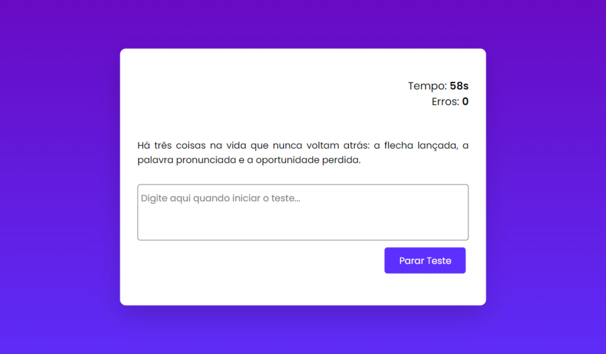

# App Teste de Digitação

## Sobre o projeto

App simples para testar a digitação do usuário.

## Como utilizar

Basta clicar no botão iniciar teste para iniciar, no final da digitação, é mostrado a quantidade de erros e o timer.

## Informações

Projeto desenvolvido utilizando apenas HTML, CSS e JavaScript.

